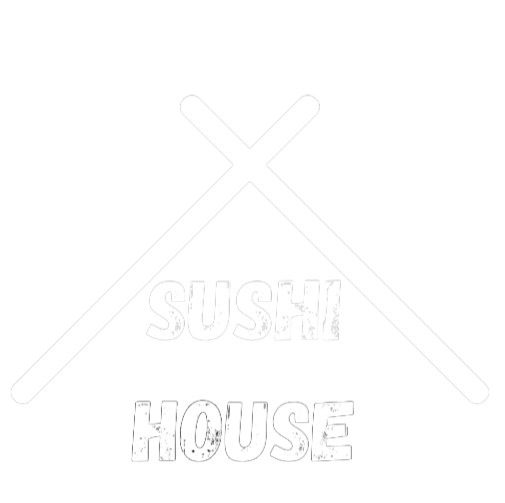

# Sae 401 : Sushi House 🍣

## Sommaire

1. [Présentation du projet](#présentation-du-projet)
2. [Analyse des besoins de l'application](#analyse-des-besoins-de-lapplication)
3. [diagramme de class](#diagramme-de-class)
4. [diagramme d'activité](#diagramme-d'activité)
5. [Collaboration](#collaboration)
6. [USER EVIL STORIES](#user-evil-stories)
7. [Le RGPD](#Le-RGPD)
8. [Le Maquette](#Maquette)
8. [Conclusion](#Conclusion)

## Présentation du projet

Nom de l'application : Sushi House

Équipe de développement :  [Victoria Moukielo (chef de projet 👑)](https://github.com/Torycia) , [Raphaël Boucheron](https://github.com/rboucheron), [Jaraf Gueye](https://github.com/JarafG), [Yaëlle Jehu](https://github.com/Yalou09)

Logo : 

  

Technologie utilisée pour le développement front_end : [Angular CLI](https://github.com/angular/angular-cli) version 17.1.2.
[tailwindcss](https://tailwindcss.com/)

## Analyse des besoins de l'application 

## diagramme de class

## diagramme d'activité

## Collaboration 

[liens vers le trello](https://trello.com/invite/b/bB11rJYZ/ATTIa3332ba1b0ecb6a44310823187a12c4757D9D428/sae-401)

## USER EVIL STORIES

Story 1 :
- Un client malveillant et qui s'y connait en informatique essaie d'accéder a notre code et modifier nos fonctions qui gèrent le prix total dans le panier. Il a acheté 5 boxs et veut modifier le total pour qu'il ait moins a payer.
- Il accède au local storage et modifie les prix des boxes

Notre solution : 
- Ne stocker seulement les ID et la quantité des boxes dans le local storage.

Story 2 : 
- Un client malveillant et qui s'y connait en informatique essaie d'accéder a notre API et donc a notre base de données.
- un client malveillant à accés à toutes les méthode du  crud il peut donc ajouter supprimer et modifier des données.  

Notre solution : 
- Nous avons supprimé les méthode CUD (POST, PUT, DELETE) et Pour empécher sela nous pouvons crée une authentification d'aministrateur

## Le RGPD 

 Notre application/site web ne récolte pas les données personnelles des utilisateurs, ce qui signifie que nous ne recueillons pas d'informations telles que les noms, adresses e-mail, numéros de téléphone, ou d'autres données identifiant directement les utilisateurs. Par conséquent, nous n'avons pas besoin de réaliser d'évaluation des risques pour la protection des données (RGPD).

Le RGPD (Règlement Général sur la Protection des Données) est une législation européenne qui vise à renforcer et à unifier la protection des données pour tous les individus au sein de l'Union européenne (UE). Il impose des obligations strictes aux entreprises qui collectent, traitent ou stockent des données personnelles des citoyens de l'UE. Cependant, puisque notre activité n'implique pas la collecte de telles données, nous ne sommes pas soumis aux exigences du RGPD. 

## Maquette

[liens vers la figma](https://www.figma.com/file/qpG2KFLAUv3hHR27enkNqU/SAE401-official?type=design&node-id=0%3A1&mode=design&t=aLZhk8esmMo1Hsnd-1)

## Conclusion 

Nous avons développé une application qui simplifie la commande de sushis en utilisant des bornes interactives. Grâce à une API REST, les utilisateurs peuvent parcourir les différents menus disponibles et passer leurs commandes facilement. Tout le processus de sélection des articles et de validation des commandes est géré localement dans le navigateur de l'utilisateur. Nous avons utiliser le framework Angular qui assure une expérience fluide et qui facilite le développement. Grace à l’architecture de single page application (SPA), nous avons réussi à éviter le rechargement complet du site à chaque transition de page. 
Durant ce projet, nous avons appris à utiliser le framework Angular, le langage TypeScript et le framework CSS Tailwind. Côté back-end, nous avons réalisé une API REST.